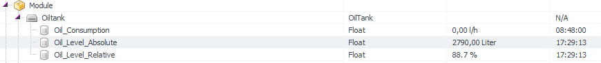
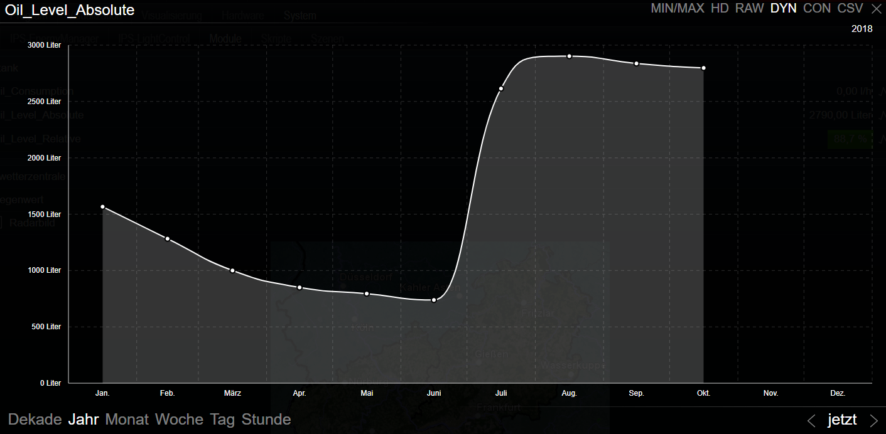

# SymconOilTank
IP-Symcon Modul zur Datenerfassung und Auswertung von Öltanks.

## Aufgabe des Moduls
Dieses Modul liest von einem Ölpegelsensor Daten aus und ermittelt damit den aktuellen Ölstand absolut, in Litern und relativ, in Prozent aus.
Dabei gilt die Annahme, dass der Ölpegelsensor von Oben die Distanz zwischen dem Sensor und dem Ölpegel im Tank in Zentimetern ausgibt und
der Öltank über eine proportionale Literzahl je Zentimeter Füllhöhe verfügt. Alternativ, kann eine Peiltabelle des Tankherstellers oder 
eine eigene Füllstandstabelle in der Modulkonfiguration angelegt werden.

## Unterstützte Sensoren
* ProJET LevelJET ST, angebunden über einen ProJET JKM-868 (LevelJET) Modul
* oder jeder andere Sensor, welche eine Füllstandshöhe in cm ausgibt

## Weiterführende Informationen
Das Modul legt selbstständig benötigte Variablen und Variablenprofile an.
Derzeit sind dies 3-Variablen und 3 Variablenprofile. (Je nach IP-Symcon Lizenz bitte berücksichtigen)
Durch das Speichern der Werte in IPS-Variablen wird Logging und das Anbinden von IPS-Events ermöglicht.
Zur besseren Auffindbarkeit und eindeutigen Zuordnung werden alle Variablenprofile mit einem in der Modulkonfiguration festgelegten Präfix angelegt. 
Standardmässig lautet das `oil_`.

## ToDo
* Ölverbrauch pro Stunde / Tag berechnen

#ä Screenshots
**Symcon-Console**

**Beispiel Ölstand / Tankinhalt über ein Jahr**
